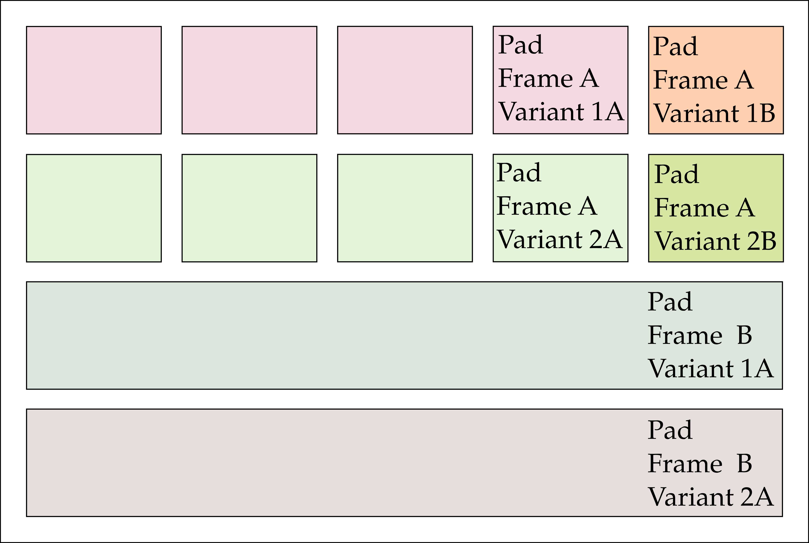

# 1.2 GHz Transimepance Amplifier 

## Specifications and Design consideration
The TIA was designed for reading out silicon carbide (SiC) sensors for proton and carbon ion beams. Besides this it is desinged for nanotechnology experiments. The bandwith is based on the pulse lengths expected from sensors with 100 µm thick epitaxial layers. The input capacitance to work with is up to 3 pF which is typical for strip sensors. 
Thus the overall spectifications are:
- Bandwidth: 1.2 GHz
- Input capacitance: Up to 3pF
- Output impedance: 50 Ohm 
- Gain: 60 to 80 dBOhm

A schematic representatin is given in the following of the circuit is given in the following.

The design is meant to be DC coupled. To this end, two TIAs were implemented, both feedin their output to a differential amplifiers. To minimize noise, the out of one tia is low-pass filtered before being fed into the difference amplifiert. This TIA acts as DC reference. The second TIA acts as main amplifier and is to be connected to the radiation sensor. For biasing a reference current generator was implemented providing 8µA of current with 10% accuracy. A differential 50 Ohm line driver provides additional amplification to the TIA output signal and enoutgh signal strength to be able to connect an oscilloscope or other data acquisition system.

- The design of the reference current generator is based on [Wang et al. "A 65-nm CMOS Constant Current Source With Reduced PVT Variation"](https://doi.org/10.1109/TVLSI.2016.2633566)
- The design of the output driver is based on [Atef and Zimmermann, "Low-power 10 Gb/s inductorless inverter based common-drain active feedback transimpedance amplifier in 40 nm CMOS"](https://link-springer-com.ezproxy.cern.ch/article/10.1007/s10470-013-0117-8)
- The design of the TIA takes elements from the following publications: 
    - [Atef and Zimmermann, "Low-power 10 Gb/s inductorless inverter based common-drain active feedback transimpedance amplifier in 40 nm CMOS"](https://link-springer-com.ezproxy.cern.ch/article/10.1007/s10470-013-0117-8) 
    - [Sing et al. "Low Noise And Low Power Transimpedance Amplifier using Inverter Based Local Feedback"](https://ieeexplore.ieee.org/document/9645841/)

## Die Overview
The die consists of several pad-frames containing different variants of the TIA. The distribution of the pad-frames over the dies is given in the following: 
The variants are as follows:
- Variant1: Two-channels; High gain output stage resulting in around 80 dBOhm.
- Variant1B: Two-channels; High gain output stage resulting in around 80 dBOhm. Low frequency suppression on the main TIA.
- Variant2: Two-channels; Low gain output stage resulting in around 60 dBOhm.
- Variant2B: Two-channels; Low gain output stage resulting in around 80 dBOhm. Low frequency suppression on the main TIA.
- Variant3: 18-channels; High gain output stage resulting in around 80 dBOhm.
- Variant4: 18-channels; Low gain output stage resulting in around 60 dBOhm.

The smaller pad-frames contain 2 copies of the TIA. They are intended for reading out pad-sensors and for debugging. The connections for nanotechnology experiments is given in the following:

Note the blue and red lines. The red lines will one be present if metal layer 5 is processed. Thus, if only layer 4 is present the "In" and "In ref." bonding pads will be floating. However, the pad capacitance will not be present reducing noise.

The bonding pads are as follows:

The pads Ex COM and Ex VH are for connecting external signals to the nanotechnology experiment. VDD should be connected to a 1.8V supply.

The larger pad-frames contain 18 copies of the TIA for use with strip sensors. When the latter is used power consumption and thus heat generation can be considerable and proper cooling needs to be ensured. The full pad frame is shown in the following:

To save pads in this version of the pad-frame the input pads have different functions depensing on the presence of metal layer 5. If metal layer 5 is present they act inputs to the TIAs. If metal layer 5 is absent, they provide external signals to the nanotechnology experiment. An illustration is given in the following:

The bond-pads are assigned as follows:

Please make sure to all VDD and GND pads. The current consumption of the TIAs in this pad-frame can be substantial.

## Schematics
Schematics are provided in the xschem folder. Please make sure to provide a valid xschemrc linking to the Skywater pdk. The schematics follow the naming of the variants. core1.sch corresponds to variant1, etc. Test benches are provided in the form of test_core1.sch. The best starting point when looing at the schematics is to look at this test benches. 

Test benches ending with _mc, e.g. test_core1_mc.sch are ment to consider process corners, temperature variation, supply voltage variation and device mismatch. The supply voltage and process corner have place-holders which are meant to be replaced with actual values using a script priot to running simulations. The placeholders are \#UB\# for the supply voltage is \#MODEL\# for the process corner. Temperature variations and device mismatch are implemented with loops in the spice code.

## Layout
The layout was drawn done using magic. The files are located in the mag folder. Once again, make sure, you have a properly configured .magicrc file pointing to the skywater pdk. The top cell is contained in top.mag. However due to the size of the full top cell, it is better to have a look at e.g. core1.mag. Again the number corresponds to the variant. 

Gds files are save in the gds folder. The currently provided gds file was modified prior to production. The pad-frames were moved appart and metal-fill was addedd. Thus, do not rely on the absolute location of objects.

## Bring-up
For initial bring-up of the ASIC it is recommended to first check if the bias output current is available. It should be between 7 and 9 µA towards ground. If this is the case, check the output voltage. It should be between 0.8 and 1.4 V. Now inject a charge into the input. This can be done by applying a step function to a small capacitor (e.g. 1pF). Measure the response at the output. You should now be able to directly see the transfer function of the TIA.